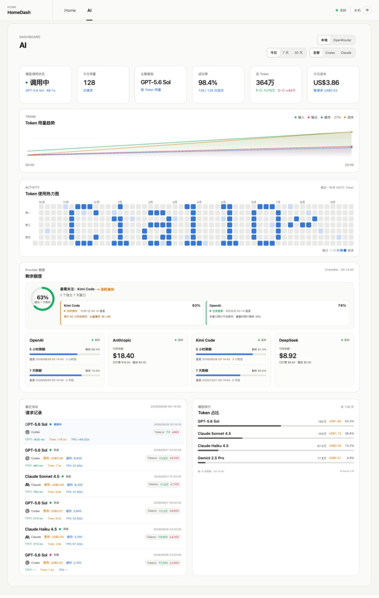

# AI HomeLab Dashboard

自托管的个人仪表盘,通过本机或 Tailnet 访问:一个页面看网络状态(Tailscale、Clash Verge 代理),另一个页面看 AI 用量(CC Switch 本地数据与 OpenRouter)。后端为纯 Python 标准库实现,无第三方依赖。



## 功能特性

**Home 页**

- Tailscale 在线状态、活动连接路径、Home DERP 区域与往返延迟
- Clash Verge(Mihomo)当前 `PROXY` 组选中的节点名称与数据新鲜度
- CodexBar Provider 额度(与 AI 页共享面板)

**AI 页**

- 本地 / OpenRouter 双数据源切换,互不影响
- CC Switch 用量汇总:请求数、主力模型、成功率、总 Token(含输入/输出拆分)
- 时间范围(今日 / 7 天 / 30 天)与应用(全部 / Codex / Claude)筛选
- CodexBar Provider 额度:按量付费显示余额,Coding plan 显示剩余额度进度条
- 最近活动:每次调用的 TTFT / Time / TPS,进行中的调用实时混入
- 模型排行:本地按 Token 占比,OpenRouter 按 credits 占比

界面为卡片式布局,兼顾桌面与移动端;默认中文,可切换英文;动画遵循 `prefers-reduced-motion`。

## 工作原理

```
宿主机采集器 ──写入──> 脱敏 JSON 快照 ──只读挂载──> Docker 容器(只读 API)──> 浏览器
(每 5 分钟 + 1 秒级 live 线程)   ~/Library/Application Support/HomeDash/
```

容器从不直接接触凭据或原始数据:它只能读到采集器脱敏后写出的快照文件,以及只读挂载的 CC Switch 数据库。因此启动顺序是**先启动采集器,再启动容器**。

## 前置依赖

- macOS + OrbStack(或 Docker Desktop)
- Python 3(运行宿主机采集器,无需安装任何包)
- [CodexBar CLI](https://github.com/steipete/CodexBar)(Provider 额度数据源)
- Tailscale(网络状态数据源)
- 可选:Clash Verge(代理节点展示)、OpenRouter Management Key(OpenRouter 数据源)

## 快速开始

1. 启动 OrbStack。

2. 创建配置文件,并将其中的 `yourname` 替换为当前 macOS 用户名:

   ```bash
   cp .env.example .env
   ```

3. 启动宿主机采集器:

   ```bash
   ./scripts/codexbar-collector start
   ```

4. (可选)如需展示 OpenRouter 余额与用量,先在 OpenRouter 后台创建专用 Management Key,然后录入 macOS Keychain:

   ```bash
   ./scripts/openrouter-key set
   ./scripts/openrouter-key status
   ```

   `set` 不接收命令行明文密钥,请在 Keychain 的安全提示中输入。删除本机副本用 `./scripts/openrouter-key delete`;删除后仍需在 OpenRouter 后台撤销远端 Key。

5. 构建并启动:

   ```bash
   docker compose up -d --build
   ```

6. 打开 Dashboard,默认地址为 <http://127.0.0.1:8787>。

停止服务:

```bash
docker compose down
```

## 配置

所有配置在 `.env` 中:

| 变量 | 默认值 | 说明 |
| --- | --- | --- |
| `CC_SWITCH_DB_PATH` | (必填) | 宿主机上 `cc-switch.db` 的绝对路径,只读挂载进容器 |
| `CODEXBAR_SNAPSHOT_DIR` | `/Users/yourname/Library/Application Support/HomeDash` | 采集器快照目录,只读挂载进容器 |
| `DASHBOARD_BIND_IP` | `127.0.0.1` | 监听地址。如需从 Tailnet 其他设备访问,运行 `tailscale ip -4` 获取本机 Tailscale IPv4 并填入 |
| `DASHBOARD_UID` | `501` | 容器运行用户的 UID,用 `id -u` 查询实际值 |
| `DASHBOARD_GID` | `20` | 容器运行用户的 GID,用 `id -g` 查询实际值 |

> **注意**:不要把 `DASHBOARD_BIND_IP` 设为 `0.0.0.0`,除非明确希望同时向其他网络接口开放。设为 Tailscale IP 时,Dashboard 只通过该 Tailnet 地址可达。

## 采集器

`scripts/codexbar-collector` 在宿主机后台运行,关闭终端后不受影响;Mac 重启后需要手动再次 `start`。

```bash
./scripts/codexbar-collector start    # 启动(立即采集一次,然后转入后台)
./scripts/codexbar-collector status   # 查看运行状态与各快照概况
./scripts/codexbar-collector once     # 手动采集一次
./scripts/codexbar-collector stop     # 停止
```

- **采集周期**:Provider 额度、Tailscale、Clash Verge、OpenRouter 每 5 分钟一次;另有约 1 秒周期的轻量线程,仅在 CC Switch 对应应用启用路由模式时读取会话元数据,生成实时活动快照。
- **输出位置**:`~/Library/Application Support/HomeDash/`(目录权限 `700`,快照文件 `600`)。
- **日志**:同目录下 `codexbar-collector.log`,达到 1 MiB 后轮转为 `.log.1` 且仅保留一个备份,总占用约 2 MiB,权限 `600`。
- **数据延迟提示**:某个数据源连续 15 分钟没有成功数据时,对应面板会独立显示数据延迟。

## 安全与隐私

设计的核心原则是**容器只接触脱敏后的数据**:

- **快照脱敏后落盘**:采集器把脱敏结果原子写入快照目录;Docker 只读挂载该目录,不接触 CodexBar 凭据、Tailscale LocalAPI/socket 或任何 CLI 原始输出。
- **Tailscale**:快照只保留在线状态、连接路径枚举、公开 DERP 区域、延迟与时间;不保存设备名、IP、用户、Peer 数量或节点标识。
- **实时活动**:快照只包含应用、模型、调用状态、时间和估算性能值;不包含提示词、回复正文、文件路径、工具参数、会话标识或原始错误。超过 5 秒未更新时,API 自动清空进行中记录。
- **Clash Verge**:采集只读取本机配置中的 Unix socket 路径和 secret,精确查询 `PROXY` 组,两者仅存在于采集进程内存;快照只保留当前选中节点名称、状态和时间,不保存候选节点、服务器地址、订阅或原始错误。HomeDash 不会启用 Clash Verge 的 TCP 控制端口,也不能切换节点。
- **OpenRouter**:Management Key 固定存放在 macOS Keychain 的 `homedash.openrouter.management` 条目中;采集器只向 `https://openrouter.ai/api/v1/activity` 和 `/api/v1/credits` 发送 GET 请求;Key 不进入 Docker、环境变量、日志、快照或浏览器。快照只保留 credits 汇总及按模型聚合的公开用量字段,不保存 endpoint ID、API Key hash、workspace、用户或账户身份。Management Key 本身具有管理 API Key 的权限,建议为 HomeDash 单独创建并定期轮换。
- **CC Switch 数据库**:以 `mode=ro` 只读方式打开,容器看不到 CC Switch 的认证文件、设置、日志或会话正文。
- **容器加固**:文件系统只读、`no-new-privileges`、非 root 用户运行、默认只绑定 `127.0.0.1`。

## 数据口径

- 可选范围:今日、最近 7 天、最近 30 天;可选应用:全部、Codex、Claude。
- 总 Token 按 CC Switch 用量口径汇总输入、输出、缓存读取与缓存创建 Token。
- 模型排行按总 Token 排序,占比也按总 Token 计算;名称优先使用 CC Switch `model_pricing.display_name`,缺失时回退到原始模型 ID。
- Provider 额度不受日期和 Codex/Claude 筛选影响。
- OpenRouter 视图范围固定为最近 30 个已结束的 UTC 日,模型按 credits 用量排序,不与本地排行混合。
- Tailscale 活动连接路径是所有活动 Peer 的脱敏汇总;Home DERP 的存在不代表当前流量一定经过 DERP。
- TTFT、Time、TPS 和"调用中"状态只在对应应用的 CC Switch 路由模式启用时显示;"全部"筛选下任一应用启用即保留指标位置,缺失值显示 `—`。已完成请求优先使用 CC Switch 数据库精确值,进行中值标记为估算。

## API 一览

所有端点只接受 `GET`/`HEAD`,返回 JSON(`Cache-Control: no-store`);快照不可用时返回 `503`。

| 端点 | 说明 |
| --- | --- |
| `GET /api/v1/health` | 健康检查与数据库可读性 |
| `GET /api/v1/dashboard?range=&app=` | 仪表盘汇总;`range`: `today`/`7d`/`30d`,`app`: `all`/`codex`/`claude` |
| `GET /api/v1/providers` | CodexBar Provider 额度快照 |
| `GET /api/v1/tailscale` | Tailscale 状态快照 |
| `GET /api/v1/clash-verge` | Clash Verge 代理快照 |
| `GET /api/v1/openrouter` | OpenRouter 余额与用量快照 |
| `GET /api/v1/live-activity` | 实时调用活动快照 |

## 本地测试

无需安装 Python 包:

```bash
PYTHONPATH=. PYTHONPYCACHEPREFIX=/tmp/cc-dashboard-pycache python3 -m unittest discover -s tests -v
node --check static/app.js
```

健康检查:

```bash
curl http://127.0.0.1:8787/api/v1/health
# 其余端点:providers / tailscale / clash-verge / openrouter / live-activity
```

## 商标说明

最近活动中的 OpenAI Blossom 与 Anthropic 标识仅用于识别对应调用来源。OpenAI 与 Anthropic 的名称及标识归各自权利人所有;HomeDash 与两家公司不存在赞助或背书关系。使用时应同时遵循 [OpenAI 品牌指南](https://openai.com/brand/)与 [Anthropic Press Kit](https://www.anthropic.com/press-kit)。

## 参考

[界面与功能参考:NodeSeek 帖子](https://www.nodeseek.com/post-810228-2)
